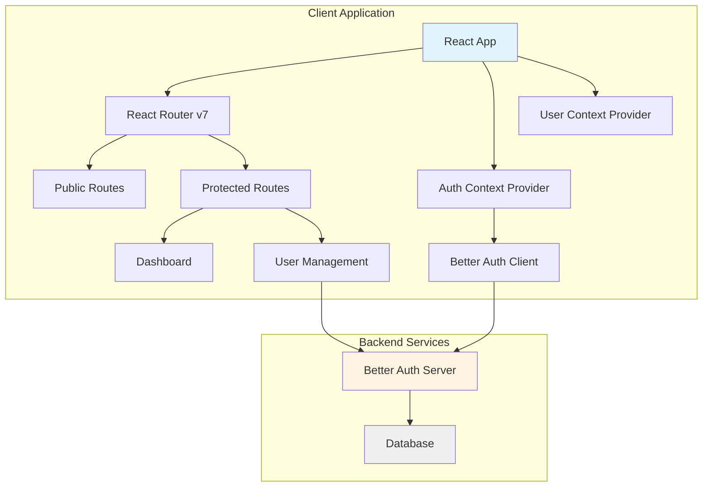

# Design Document

## Overview

This document outlines the technical design for a User Management Application built with React, React Router v7, Better Auth, shadcn/ui components, and React Context for state management. The application provides administrators with a secure dashboard to manage user accounts through CRUD operations.

The architecture follows a client-side React application pattern with Better Auth handling authentication on both client and server sides. The application uses React Router v7 for navigation with protected routes, shadcn/ui for consistent UI components, and React Context API for global state management.

## Architecture

### High-Level Architecture



### Technology Stack

- **Frontend Framework**: React 18+
- **Routing**: React Router v7
- **Authentication**: Better Auth with admin plugin
- **UI Components**: shadcn/ui (built on Radix UI + Tailwind CSS)
- **State Management**: React Context API
- **Form Handling**: React Hook Form (via shadcn/ui forms)
- **Validation**: Zod (via shadcn/ui forms)
- **Styling**: Tailwind CSS

### Project Structure

```
src/
├── components/
│   ├── ui/                    # shadcn/ui components
│   │   ├── button.tsx
│   │   ├── table.tsx
│   │   ├── dialog.tsx
│   │   ├── form.tsx
│   │   └── ...
│   ├── auth/
│   │   ├── LoginForm.tsx
│   │   └── ProtectedRoute.tsx
│   └── users/
│       ├── UserTable.tsx
│       ├── UserCreateDialog.tsx
│       ├── UserEditDialog.tsx
│       └── UserDeleteDialog.tsx
├── contexts/
│   ├── AuthContext.tsx        # Authentication state
│   └── UserContext.tsx        # User management state
├── lib/
│   ├── auth-client.ts         # Better Auth client configuration
│   └── utils.ts               # Utility functions
├── routes/
│   ├── root.tsx               # Root layout
│   ├── login.tsx              # Login page
│   ├── dashboard.tsx          # Dashboard layout
│   └── users.tsx              # User management page
├── types/
│   └── index.ts               # TypeScript type definitions
└── main.tsx                   # Application entry point
```

## Components and Interfaces

### Authentication Layer

#### Better Auth Configuration

**Server-side** (`auth.ts`):
```typescript
import { betterAuth } from "better-auth";
import { admin } from "better-auth/plugins";

export const auth = betterAuth({
  database: {
    // Database configuration
  },
  emailAndPassword: {
    enabled: true,
  },
  plugins: [
    admin({
      defaultRole: "user",
      async isAdmin(user) {
        return user.role === "admin";
      },
    }),
  ],
});
```

**Client-side** (`lib/auth-client.ts`):
```typescript
import { createAuthClient } from "better-auth/client";
import { adminClient } from "better-auth/client/plugins";

export const authClient = createAuthClient({
  baseURL: import.meta.env.VITE_API_URL,
  plugins: [adminClient()],
});
```

#### Auth Context Provider

Manages authentication state across the application:

```typescript
interface AuthContextType {
  user: User | null;
  isLoading: boolean;
  isAdmin: boolean;
  login: (email: string, password: string) => Promise<void>;
  logout: () => Promise<void>;
}
```

### Routing Structure

#### Route Configuration

Using React Router v7's route configuration:

```typescript
// routes.ts
import { RouteConfig, route, index } from "@react-router/dev/routes";

export default [
  index("routes/login.tsx"),
  route("dashboard", "routes/dashboard.tsx", () => [
    index("routes/users.tsx"),
  ]),
] satisfies RouteConfig;
```

#### Protected Route Implementation

Middleware-based authentication check:

```typescript
// middleware/auth.ts
export async function authMiddleware({ context, request }) {
  const user = await getCurrentUser(request);
  
  if (!user || user.role !== "admin") {
    throw redirect("/login");
  }
  
  context.set(userContext, user);
}
```

### User Management Components

#### UserTable Component

Displays list of users with actions:

**Props Interface**:
```typescript
interface UserTableProps {
  users: User[];
  onEdit: (user: User) => void;
  onDelete: (userId: string) => void;
  isLoading: boolean;
}
```

**Features**:
- Uses shadcn/ui Table component
- Displays user email, name, registration date, status, and role
- Action buttons for edit and delete operations
- Loading state with skeleton UI
- Empty state when no users exist

#### UserCreateDialog Component

Modal form for creating new users:

**Props Interface**:
```typescript
interface UserCreateDialogProps {
  open: boolean;
  onOpenChange: (open: boolean) => void;
  onSuccess: () => void;
}
```

**Form Fields**:
- Email (required, email validation)
- Name (required, min 2 characters)
- Password (required, min 8 characters)
- Role (select: "user" | "admin")

#### UserEditDialog Component

Modal form for editing existing users:

**Props Interface**:
```typescript
interface UserEditDialogProps {
  user: User | null;
  open: boolean;
  onOpenChange: (open: boolean) => void;
  onSuccess: () => void;
}
```

**Form Fields**:
- Email (required, email validation)
- Name (required, min 2 characters)
- Role (select: "user" | "admin")
- Email Verified (checkbox)

#### UserDeleteDialog Component

Confirmation dialog for user deletion:

**Props Interface**:
```typescript
interface UserDeleteDialogProps {
  user: User | null;
  open: boolean;
  onOpenChange: (open: boolean) => void;
  onSuccess: () => void;
}
```

### State Management with Context

#### User Context Provider

Manages user list state and operations:

```typescript
interface UserContextType {
  users: User[];
  isLoading: boolean;
  error: string | null;
  fetchUsers: () => Promise<void>;
  createUser: (data: CreateUserData) => Promise<void>;
  updateUser: (userId: string, data: UpdateUserData) => Promise<void>;
  deleteUser: (userId: string) => Promise<void>;
}
```

**State Management Pattern**:
- Centralized user data fetching and caching
- Optimistic updates for better UX
- Error handling with user-friendly messages
- Loading states for async operations

## Data Models

### User Model

```typescript
interface User {
  id: string;
  email: string;
  name: string;
  role: "user" | "admin";
  emailVerified: boolean;
  createdAt: Date;
  updatedAt: Date;
  banned: boolean;
  banReason?: string;
  banUntil?: Date;
}
```

### Form Data Models

```typescript
interface CreateUserData {
  email: string;
  name: string;
  password: string;
  role: "user" | "admin";
}

interface UpdateUserData {
  email?: string;
  name?: string;
  role?: "user" | "admin";
  emailVerified?: boolean;
}
```

### API Response Models

```typescript
interface ListUsersResponse {
  data: User[];
  total: number;
  limit: number;
  offset: number;
}

interface ApiError {
  message: string;
  code: string;
  details?: Record<string, string[]>;
}
```

## Error Handling

### Error Handling Strategy

1. **Authentication Errors**:
   - Invalid credentials: Display error message on login form
   - Session expired: Redirect to login with message
   - Unauthorized access: Redirect to login

2. **API Errors**:
   - Network errors: Display toast notification with retry option
   - Validation errors: Display field-specific error messages
   - Server errors: Display generic error message with support contact

3. **Form Validation**:
   - Client-side validation using Zod schemas
   - Real-time validation feedback
   - Prevent submission with invalid data

### Error Display Components

- **Toast Notifications**: For non-blocking errors and success messages
- **Inline Form Errors**: For validation errors
- **Error Boundaries**: For catching React component errors
- **Empty States**: For no data scenarios

### Error Recovery

- Automatic retry for transient network errors
- Manual retry buttons for failed operations
- Clear error messages with actionable steps
- Preserve form data on submission errors

## Testing Strategy

### Unit Testing

**Components to Test**:
- Form validation logic
- Context providers (AuthContext, UserContext)
- Utility functions
- Individual UI components

**Testing Tools**:
- Vitest for test runner
- React Testing Library for component testing
- MSW (Mock Service Worker) for API mocking

**Test Coverage Goals**:
- Critical paths: 100%
- Business logic: 90%+
- UI components: 80%+

### Integration Testing

**Scenarios to Test**:
- Complete authentication flow (login → dashboard → logout)
- User CRUD operations end-to-end
- Protected route access control
- Form submission with validation
- Error handling and recovery

### E2E Testing (Optional)

**Tools**: Playwright or Cypress

**Critical Flows**:
- Admin login and user management workflow
- Create, edit, and delete user operations
- Navigation between routes
- Session persistence and logout

## Security Considerations

### Authentication Security

- Passwords hashed using Better Auth's built-in security
- Session tokens stored securely (httpOnly cookies)
- CSRF protection enabled
- Rate limiting on authentication endpoints

### Authorization

- Role-based access control (RBAC)
- Admin-only routes protected by middleware
- API endpoints validate user permissions
- Client-side route guards for UX

### Data Protection

- Input sanitization on all form fields
- XSS protection through React's built-in escaping
- SQL injection prevention through ORM/query builder
- Sensitive data (passwords) never exposed in responses

### Best Practices

- Environment variables for sensitive configuration
- HTTPS required in production
- Regular security dependency updates
- Audit logging for admin actions

## Performance Considerations

### Optimization Strategies

1. **Code Splitting**:
   - Lazy load routes using React Router v7
   - Dynamic imports for heavy components
   - Separate bundles for admin features

2. **State Management**:
   - Minimize context re-renders with proper memoization
   - Use separate contexts for auth and user data
   - Implement pagination for large user lists

3. **API Optimization**:
   - Debounce search/filter operations
   - Cache user list data in context
   - Implement optimistic updates for better UX

4. **UI Performance**:
   - Virtual scrolling for large tables (if needed)
   - Skeleton loaders for better perceived performance
   - Minimize re-renders with React.memo

### Bundle Size

- Tree-shaking for unused code
- Optimize shadcn/ui component imports
- Minimize third-party dependencies
- Use production builds for deployment

## Deployment Considerations

### Build Configuration

- Vite for fast builds and HMR
- Environment-specific configuration files
- Production optimizations enabled
- Source maps for debugging

### Environment Variables

```
VITE_API_URL=<backend-api-url>
VITE_APP_NAME=Better-Admin
```

### Hosting Options

- Static hosting (Vercel, Netlify, Cloudflare Pages)
- CDN for asset delivery
- Backend API hosted separately

## Future Enhancements

### Potential Features

1. **Advanced User Management**:
   - Bulk user operations
   - User import/export (CSV)
   - Advanced filtering and search
   - User activity logs

2. **Enhanced Security**:
   - Two-factor authentication
   - Password reset flow
   - Email verification
   - Session management dashboard

3. **UI Improvements**:
   - Dark mode support
   - Customizable table columns
   - Advanced data visualization
   - Mobile-responsive design

4. **Audit and Compliance**:
   - Comprehensive audit logs
   - User action history
   - Compliance reporting
   - Data export capabilities
